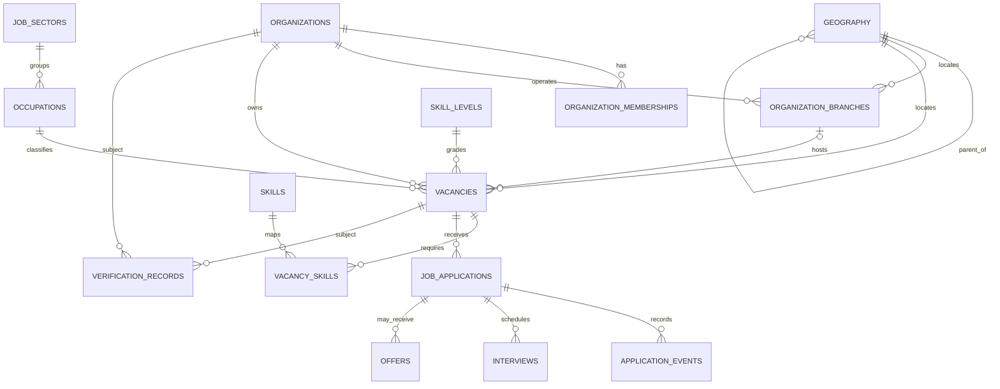

# Phase 2A — Jobs & Recruitment: Documentation-Only Specification

**Status:** Proposed for owner review; not implementation authorization.  
**Authority:** Supplied Immigration & Employment Global Mobility Master Plan V2, especially §§4–5, 31, 34–36.  
**Scope:** Documentation and diagrams only. No app code, migrations, schema changes, seeds, runtime/configuration/workflow changes, deployment, backup, restore, or migration execution.

## 1. Safety and current baseline

PR #24 (branding and static public website foundation) was merged into `main` by merge commit [`57b1b2337b1da16a25188cee7700cccffed67cec`](https://github.com/job-grid/job-grid/commit/57b1b2337b1da16a25188cee7700cccffed67cec). That merge establishes the branded static website foundation only; it does **not** complete Master Plan V2 Phase 1. Identity/MFA, organization and role management, canonical geography, person profiles, application-level audit, secure document storage, operational administrative catalogs, and observability are separate capabilities and remain unimplemented or unverified as detailed below.

The current repository foundation is static HTML/CSS/JavaScript with sample job cards. No live recruitment API, database-backed vacancy search, candidate application workflow, employer/agency portal, moderation workflow, or private applicant-document flow has been verified. A successful static preview or green CI is not proof of those capabilities.

Phase 4C production backup, restore and migration execution remain **BLOCKED** until the owner separately approves an independent PostgreSQL recovery target and procedure, and independently verified evidence proves backup creation, read-back/integrity, and restore into that approved target. Synthetic tooling tests are not production recovery evidence.

## 2. Master Plan V2 requirements traceability

### Multi-country design rule

Design the domain model and contracts for **multiple jurisdictions from the beginning**: each organization, branch/worksite, vacancy and verification record must be able to reference the relevant jurisdiction(s), and policy/source evidence must be versioned with effective dates. Do not hard-code a single launch country into the data model. This technical capability is separate from **launch-country selection**, which remains an explicit product/legal decision, and separate again from **validation against authoritative country-specific legal and policy sources**, which requires approved sources, source freshness, jurisdiction-specific review rules and human escalation. Multi-country-capable fields or code do not prove legal compliance in any country. Missing, stale or conflicting authoritative evidence must block publication or route it to authorized human review.

| Exact V2 reference | Requirement interpreted for Phase 2A | Current evidence | Test/evidence status | Remaining gap / acceptance evidence |
|---|---|---|---|---|
| §4 | Controlled sectors, occupations, skill levels and skills; vacancy location, qualifications/licences/languages, salary/currency/pay period, contract/hours, benefits/accommodation, count, sponsorship, verification, publication/expiry | Static sample cards only; no live domain model/API verified | NOT IMPLEMENTED | Approve field policy and catalogs; later validation, catalog provenance and API integration tests |
| §5 | Employer/recruiter marketplace; branches/worksites; employer verification; vacancy moderation; candidate pipeline; interviews, offers/contracts; agency licensing/jurisdiction, mandates, submissions, placements, fee disclosure, complaints/compliance | No operational marketplace or recruitment workflow verified | NOT IMPLEMENTED | Approve agency model, verification standards and initial jurisdiction; prove tenant isolation and role enforcement |
| §5 | Offer verification: unique reference, employer/worksite, contract link, QR/reference, expiry/withdrawal and audit | No offer-verification capability verified | NOT IMPLEMENTED | Decide whether in Phase 2A or later; specify revocation and public disclosure |
| §31 | React + TypeScript reference stack; PostgreSQL/Supabase where appropriate; storage; standards-based auth/MFA; CDN/WAF/API gateway; CI/CD; observability | Static foundation and governance workflows exist; no operational recruitment backend certified | PARTIAL at foundation/governance level | Approve target frontend, trusted API boundary, data/auth platform and Cloudflare topology |
| §34 | Availability, scalability, accessibility, localization, mobile responsiveness, fast search, resumable uploads, idempotency, observability, tested RPO/RTO and portability | Static presentation only; no recruitment SLO, upload, idempotency or restore evidence | NOT VERIFIED / NOT MET for product | Set measurable SLOs, locale/accessibility target, document controls and RPO/RTO |
| §35 — Phase 0 | Country/program selection, legal/privacy/security review, classification, threat model and authoritative policy sources | Governance documentation exists; Phase 2 launch jurisdiction is unresolved | PARTIAL; recruitment approvals unresolved | Owner selects launch jurisdiction/program and approves legal/privacy/security assessment |
| §35 — Phase 1 | Auth/MFA, organizations/roles, geography, person profile, audit, storage, admin catalogs, CI/CD | PR #24 is branding/static shell; operational auth/MFA, organization, profile, domain audit and private storage are not verified | NOT COMPLETE; CI/CD alone is insufficient | Track each foundation capability and evidence separately; do not claim V2 Phase 1 complete |
| §35 — Phase 2 | Employers/agencies, occupations/skills, vacancies, search, applications, interviews, offers/contracts, verification | No live recruitment-domain capabilities verified in current static site | NOT IMPLEMENTED | This specification is a proposal only; implementation needs separate authorization |
| §36 | Unit/integration, authorization/RLS, cross-tenant/country isolation, policy regression, payment/document security, penetration, accessibility, load/failover, restore, audit, privacy/retention, AI grounding/privacy/human-control gates | Existing CI and synthetic Phase 4C validation do not prove recruitment-specific gates | NOT PASSED for production recruitment release | Evidence each applicable release gate; no production release merely because features render |


## 2.1 Foundation capability assessment — evidence checked against current `main`

**Assessment baseline:** repository `main` at `8b5a89ccdb85d5e3eba6ab6dcbe96df84d2ec08d` before this PR refresh. This is a repository/source inspection, not a live production-system audit. “Implemented and evidenced” means the stated scope is present in repository artifacts; it does not certify production operation or Master Plan V2 Phase 1 completion.

### Implemented and evidenced (narrow scope only)

| Capability | Evidence | Boundary |
|---|---|---|
| Branded public static website shell | `index.html`, `styles/global.css`, `styles/tokens.css`, `scripts/components.js`, `scripts/main.js`, `public/job-grid-logo.png` | Public presentation only; sample job cards are not live vacancies or a recruitment backend. Owner-reported visual QA is recorded in PR #24; it is not a full accessibility/security certification. |
| Reproducible static build command | `package.json` scripts and `scripts/build.mjs` create `dist/`; the build copies the PNG logo and browser assets | Build does not deploy, authenticate users, connect to a backend or prove production deployment. |
| Repository CI for current static shell | `.github/workflows/ci.yml` defines Node 22 install, typecheck, lint, tests, static build artifact, migration-convention validation and repository integrity checks | Scope is the tests actually defined. The migration validation workflow does not execute migrations against a live database or prove end-to-end recruitment functionality. |
| Governance and migration/security scaffolding | `docs/database-migrations.md`, `scripts/validate-migrations.sh`, the existing Phase 0 RLS-related migration/test files | Control-plane/source artifacts exist; they do not constitute the Phase 2A schema, full tenant isolation, or proof that production policies are correct. |
| PR-based review controls | Active `main` repository ruleset and required CI contexts are visible through GitHub's ruleset endpoint | Review gates reduce change risk; they do not establish runtime identity, authorization, audit or observability. |

### Partially present but not fully verified

| Capability | Evidence and current assessment | Missing proof |
|---|---|---|
| Responsive interface and basic accessibility hooks | Static HTML/CSS includes responsive layout, navigation and keyboard/focus-related implementation; owner reported desktop/mobile visual review for PR #24 | Independent accessibility audit, WCAG conformance, screen-reader/manual keyboard verification across flows, localization and portal-level usability evidence |
| Cloudflare Pages Git-connected deployment path | PR #24 has a successful Preview check; the owner provided configuration screenshots recorded in PR #26's deployment document | Independently verified live settings and a successful Production deployment sourced from `main` at the exact current `main` commit. Preview success is not Production evidence. |
| CI/CD | Pull request CI and Preview checks exist | Production deployment source/revision still requires verification; no CI evidence establishes operational rollback, release SLOs, alerting or functioning application services. |
| Database security controls | Phase 0 migration files and SQL test definitions are present; CI checks migration conventions and presence/assertions | Approved non-production database execution; comprehensive RLS/authorization matrix, cross-tenant tests for implemented recruitment entities, and independent security review |
| Operational evidence and recovery tooling | Phase 4C scripts, workflows, preflight/validation code and synthetic tests exist | Actual approved independent recovery target and independently verified backup/read-back/restore evidence remain missing. Phase 4C remains **BLOCKED**. |

### Not implemented or not evidenced as operational capabilities

| Master Plan V2 foundation capability | Status | Evidence-based conclusion |
|---|---|---|
| Identity provider integration, sign-in/session lifecycle and MFA | **NOT IMPLEMENTED / NOT VERIFIED** | No operational application identity/MFA flow has been evidenced for this static website. |
| Organizations, organization memberships, tenant-scoped roles and administrative role grant controls | **NOT IMPLEMENTED** | The conceptual schema in this specification is a proposal, not deployed tables or authorization logic. |
| Canonical geography hierarchy and controlled jurisdiction data | **NOT IMPLEMENTED** | The specification describes a proposed model; no populated, versioned authoritative geography catalog is evidenced. |
| Person/candidate profile lifecycle and privacy controls | **NOT IMPLEMENTED** | No operational candidate profile, consent, access/export/deletion or retention flow is evidenced. |
| Application-level audit trail | **NOT IMPLEMENTED** | A proposed `audit_events` model and CI/deployment logs are not an application audit service. No append-only domain/security audit flow is evidenced. |
| Secure private document storage | **NOT IMPLEMENTED** | No verified private applicant-document storage, authorization, malware scanning, short-lived access, retention or deletion workflow. |
| Administrative reference catalogs | **NOT IMPLEMENTED** | Proposed geography, sector, occupation, skill and reason-code catalogs are not operational catalog management with source provenance/versioning. |
| Operational observability | **NOT IMPLEMENTED / NOT VERIFIED** | GitHub/Cloudflare build logs are deployment telemetry, not application metrics, traces, security monitoring, alerts, SLOs or incident response evidence. |
| Live recruitment domain | **NOT IMPLEMENTED** | Vacancy APIs/database-backed search, mandatory moderation execution, applications, interview/offer flows, and private candidate data handling are not implemented in the static shell. |

**Phase 1 conclusion:** V2 Phase 1 is **not complete**. The repository now has a branded static web foundation, CI/control-plane artifacts and deployment-review evidence. Those are useful prerequisites, but they do not substitute for the identity, tenancy, geography, profile, audit, storage and administrative capabilities named by V2 §35. The Phase 2A implementation proposal below must either include only the minimum necessary foundation slice or explicitly list the approved foundation services it depends on; it must not assume they already exist.


**Evidence rule:** Every requirement must be marked PASS, PARTIAL, FAIL, NOT IMPLEMENTED or NOT VERIFIED with a linked artifact/test/review. A green build proves only the checks it actually ran.

## 3. Proposed logical data dictionary

Logical design only. No physical schema or database objects are created. IDs are opaque; timestamps are UTC; controlled values should use catalog references/enums, not arbitrary free text. Physical types, retention periods and exact constraints require a later reviewed migration proposal.

| Entity | Core fields | Purpose / rules |
|---|---|---|
| organizations | id, legal_name, display_name, type (employer/agency), registration_country, registration_number, status, verification_status, created_at, updated_at | Tenant boundary; legal/display names separated; status changes audited |
| organization_memberships | id, organization_id, user_id, role, status, invited_by, created_at, revoked_at | User-to-organization membership; role is tenant-scoped; revocation effective immediately |
| organization_branches | id, organization_id, name, country_code, geography_id, address_text, status | Branch/worksite belonging to one organization |
| agency_compliance (proposed extension) | organization_id, licence_number, jurisdiction, valid_from, valid_until, verification_status, mandate_evidence_ref | Agency licensing; agency acts for employer only with valid mandate |
| geography | id, country_code, parent_id, level, canonical_name, alternate_names, source_ref, valid_from, valid_until | Country → region/province → city → town/locality; versioned approved source |
| job_sectors | id, code, label, source_ref, active | Controlled sector catalog |
| occupations | id, code, label, sector_id, framework, framework_version, active | Versioned occupation taxonomy; codes must not be invented |
| skill_levels | id, code, label, framework, framework_version, active | Controlled skill-level catalog |
| skills | id, code, label, aliases, framework, framework_version, active | Canonical searchable skills with aliases |
| vacancies | id, organization_id, branch_id, created_by, reference_code, slug, title, description, sector_id, occupation_id, skill_level_id, geography_id, worksite_text, employment_type, contract_duration, hours_per_week, salary_min, salary_max, salary_currency, pay_period, benefits, accommodation_provided, qualification_requirements, licence_requirements, language_requirements, vacancies_count, sponsorship_status, application_deadline, published_at, expires_at, status, moderation_state, verification_state, version, created_at, updated_at | Canonical vacancy; salary min ≤ max; ISO currency; explicit deadline/expiry; publication requires approved checks |
| vacancy_skills | vacancy_id, skill_id, proficiency_level, required | Many-to-many; unique vacancy/skill pair |
| job_applications | id, vacancy_id, candidate_user_id, status, submitted_at, withdrawn_at, candidate_snapshot_ref, idempotency_key_ref, created_at, updated_at | Candidate-owned application; identity from session, not request body |
| application_events | id, application_id, actor_user_id, event_type, from_status, to_status, reason_code, created_at | Append-only status history |
| interviews | id, application_id, scheduled_start, scheduled_end, timezone, mode, private_location_or_join_ref, status, created_by | Restricted to candidate and authorized hiring team |
| offers (later scope unless approved) | id, application_id, offer_reference, status, issued_at, expires_at, withdrawn_at, contract_document_ref, verification_code_hash | Unpredictable, revocable references; document private |
| verification_records | id, subject_type, subject_id, jurisdiction, verification_type, status, source_ref, checked_at, expires_at, reviewed_by, evidence_ref | Source and date of checks; not a guarantee of immigration eligibility |
| audit_events | id, actor_user_id, organization_id, action, resource_type, resource_id, outcome, request_id, occurred_at, minimized_metadata | Append-only security trail; exclude credentials, CV contents and unnecessary personal data |

### Data handling rules

- Never expose CVs, passports, identity documents, private evidence, internal moderation notes or candidate identities in public vacancy APIs, URLs, logs or analytics.
- Candidate documents require private object storage, ownership checks, short-lived authorized access, malware scanning, file size/type controls, retention/deletion and access logging. This is a dependency, not implemented here.
- Country-specific eligibility, sponsorship and licensing rules must cite official sources, be versioned/date-stamped, and be reviewed. Do not infer legal eligibility from occupation or nationality.
- Render vacancy descriptions safely against stored XSS. Never log raw idempotency keys, access tokens or verification secrets.
- Soft deletion is not a retention policy. Legal hold, retention, deletion, export, data residency and subject-rights rules need legal/owner approval.

## 4. Entity relationships

Conceptual Mermaid ER diagram; it is not a database migration.



Open modelling choices: agency as organization subtype vs separate entity; representation of organization verification; whether one application can receive multiple offers; and how candidate/profile identity links are modelled.

## 5. Vacancy lifecycle, mandatory review and appeal

### Publication invariant

**No vacancy is public until an authorized reviewer has approved it.** Submission, validation, employer verification and legal-policy checks are distinct steps. Technical support for multiple countries does not select a launch country and does not establish that a vacancy is lawful or compliant in any jurisdiction. Each vacancy must identify its relevant jurisdiction(s), and the configured review policy must require evidence from approved, current authoritative sources for those jurisdiction(s). If the required source, policy version or review evidence is missing, expired or contradictory, publication is blocked and the case is escalated for human review.

The vacancy owner, employer, agency and any person acting for them may submit information and respond to review, but **must not approve the vacancy, approve their own verification, or independently certify the legal/policy checks required for publication**. Reviewer identity and organization/agency conflicts must be checked before a decision is accepted. Automated checks may flag issues or block invalid records; they do not replace the authorized human approval gate.

### States

- **draft** — editable by authorized organization members; never publicly searchable.
- **submitted** — submitted by the employer/authorized agency; immutable submission snapshot/version recorded; not public.
- **under_review** — assigned to an authorized, non-conflicted reviewer; not public.
- **changes_requested** — reviewer returns specific field-level corrections and reason codes; not public.
- **rejected** — reviewer declines publication with reason codes and an explanation; not public.
- **approved** — authorized reviewer approved the exact submitted version and required verification/policy checks; still not public until publication preconditions are atomically rechecked.
- **published** — public only after approval, organization eligibility, source/policy validity, required fields and publication window are confirmed.
- **suspended** — immediately hidden while a material concern is investigated; existing applications are retained and access is policy-controlled.
- **closed** — no longer accepts new applications; remains non-searchable, while existing application records follow approved policy.
- **expired** — deadline/publication window ended; hidden and closed to new applications.
- **appeal_pending** — an eligible rejection or specified moderation decision is challenged; vacancy remains non-public unless an independent review explicitly changes the decision.
- **archived** — read-only retention state; terminal. Reactivation in place is prohibited; create a new version and resubmit.

### Permitted transitions

| From → to | Authorized actor / guard |
|---|---|
| draft → submitted | Authorized employer member or agency member with valid employer mandate; schema/catalog checks pass; submitter and immutable version recorded |
| submitted → under_review | Queue/assignment process; reviewer is authorized and has no declared conflict; jurisdiction and required evidence identified |
| under_review → changes_requested | Authorized reviewer; field-level actions, reason codes, policy/source references and audit event required |
| changes_requested → submitted | Authorized organization member/delegated agency corrects fields and resubmits a new version; prior version and comments retained |
| under_review → rejected | Authorized reviewer; reason and appeal eligibility/deadline recorded; audit event required |
| rejected → appeal_pending | Authorized employer/agency representative within the approved appeal window; reason and supporting evidence supplied; vacancy stays hidden |
| appeal_pending → under_review | Different authorized reviewer or independent appeal reviewer, not the original decision-maker where practicable; conflict check recorded |
| under_review → approved | Authorized non-conflicted reviewer approves exact version after all required source-backed checks pass; reviewer and evidence snapshot recorded |
| approved → published | Publication service rechecks approval/version, organization status, jurisdiction policy/source freshness, dates and required fields; event is atomic/idempotent |
| approved → submitted | Material data/source/policy change invalidates approval; re-review required |
| published → suspended | Authorized moderator, designated administrator or approved safety control; reason and urgency recorded; public hiding is immediate |
| suspended → under_review | Authorized reviewer after remediation; re-check all applicable evidence and jurisdiction policy; employer cannot self-clear |
| published → closed | Authorized organization member or moderator; no new applications; closure reason/time audited |
| published → expired | Idempotent system process after approved expiry rule; event recorded |
| closed/expired → archived | Authorized retention process/admin under approved retention policy |
| rejected/closed/expired → draft | Authorized owner creates a new version only where policy permits; old record remains immutable/auditable |

### Forbidden transitions and review controls

- Employer/agency cannot approve, publish, verify itself, clear a suspension, or bypass an outstanding review.
- A reviewer cannot approve a vacancy they own, submitted, or are materially affiliated with; conflicts must be declared and enforced.
- A material change to title, employer, worksite/jurisdiction, salary, sponsorship, qualifications, contract terms or other policy-relevant fields invalidates prior approval and returns the new version to review.
- If an authoritative source is unavailable, stale, conflicting or not configured for the jurisdiction, do not silently assume compliance; hold publication and escalate.
- Admin override is not a routine publication path. If approved by owner policy, it requires a distinct privileged role, documented reason, independent second-person review and immutable audit trail.
- Suspension must remove the vacancy from public search and detail responses immediately; existing applications are not silently deleted.
- Appeal does not automatically reinstate or publish a vacancy. Appeal reviewer should be independent of the original decision-maker where practicable. Appeal window, grounds, service-level target and finality are owner decisions.
- Every transition records actor, actor role/organization, prior/new state, version, timestamp, reason code, source/policy version references, outcome and request/correlation ID. Audit events are append-only to ordinary application roles.
- Public search only returns records in published state and within the effective publication window. Publication and expiry tasks must be idempotent and safe under retries/concurrency.

Application pipeline is separate from vacancy state: proposed submitted → under_review → shortlisted → interview_scheduled → offer_issued → hired, with side states rejected, withdrawn and closed. Every transition requires permission, valid source state, append-only event and idempotency. Duplicate-application and reapplication rules remain owner decisions.

## 6. Proposed API contracts (not implemented)

### Conventions
- Base path /api/v1; JSON UTF-8; RFC 3339 UTC timestamps; opaque IDs; cursor pagination.
- Authentication and tenant are derived from verified session/membership. Never trust user ID, organization ID, role, verification state or requested transition supplied by client.
- Use version/ETag preconditions for edits and Idempotency-Key for application submission; cap page size, query length and payload size.
- Public reads expose only published, in-window vacancies. Rate-limit search and submission. Do not reveal hidden-resource existence.
- Runtime, gateway and auth implementation remain architecture decisions.

### Public search
GET /api/v1/jobs?country=KE&region=...&city=...&sector=...&occupation=...&skill=...&q=...&employment_type=...&sponsorship=...&cursor=...&limit=25

Illustrative 200 response (not real vacancy data):
```json
{
  "data": [{
    "id": "vac_opaque",
    "reference": "JG-EXAMPLE",
    "slug": "sample-role-location",
    "title": "Sample role",
    "organization": {"displayName": "Example employer", "verificationStatus": "verified"},
    "location": {"countryCode": "KE", "region": null, "city": null, "town": null},
    "occupation": {"code": "SOURCE-CODE", "label": "Example occupation"},
    "employmentType": "full_time",
    "salary": {"min": null, "max": null, "currency": null, "payPeriod": null},
    "sponsorshipStatus": "not_stated",
    "publishedAt": "2026-01-01T00:00:00Z",
    "expiresAt": "2026-02-01T00:00:00Z"
  }],
  "page": {"nextCursor": null, "limit": 25},
  "requestId": "req_opaque"
}
```
No values or codes in examples assert an actual vacancy or legal policy. Unknown salary is null, never fabricated.

### Public detail
GET /api/v1/jobs/{slug}
- 200: public vacancy, safe organization summary, requirements and application instructions.
- 404: nonexistent or non-public vacancy; do not disclose hidden status.
- Never return candidate information, internal review notes, private evidence or private document URLs.

### Organization/moderation commands
- POST /api/v1/organizations/{organizationId}/vacancies — create draft.
- PATCH /api/v1/organizations/{organizationId}/vacancies/{vacancyId} — edit authorized draft/changes-requested version with If-Match/version.
- POST /api/v1/organizations/{organizationId}/vacancies/{vacancyId}/submit — validate and request review.
- POST /api/v1/moderation/vacancies/{vacancyId}/decision — publish, request_changes or reject with reason code and reviewer note.
- POST /api/v1/moderation/vacancies/{vacancyId}/suspend — hide immediately with reason.
- POST /api/v1/organizations/{organizationId}/vacancies/{vacancyId}/close — close authorized published vacancy.

Example create-draft request:
```json
{
  "title": "Example role",
  "description": "Draft description",
  "sectorId": "sector_opaque",
  "occupationId": "occupation_opaque",
  "skillLevelId": "level_opaque",
  "geographyId": "geo_opaque",
  "employmentType": "full_time",
  "salary": {"min": 1000, "max": 1500, "currency": "USD", "payPeriod": "month"},
  "vacanciesCount": 1,
  "sponsorshipStatus": "not_stated",
  "expiresAt": "2026-12-31T23:59:59Z"
}
```
Server assigns ID, reference, tenant, creator, status, timestamps and moderation state. Reject invalid catalog IDs, currency, date, salary range, lengths and forbidden client-managed fields.

### Application submission
POST /api/v1/jobs/{vacancyId}/applications  
Header: Idempotency-Key: opaque client-generated key

```json
{
  "coverLetter": "Optional bounded text",
  "resumeDocumentId": "private_document_opaque"
}
```

Illustrative 201:
```json
{
  "data": {
    "id": "app_opaque",
    "vacancyId": "vac_opaque",
    "status": "submitted",
    "submittedAt": "2026-10-09T00:00:00Z"
  },
  "requestId": "req_opaque"
}
```
Candidate identity comes from session. Verify vacancy is accepting applications and document ownership/scan status. Same key returns the original result. Duplicate-application policy and key retention need approval.

### Error envelope
```json
{
  "error": {
    "code": "VALIDATION_FAILED",
    "message": "One or more fields are invalid.",
    "fields": [{"field": "salary.min", "code": "MUST_NOT_EXCEED_MAX"}]
  },
  "requestId": "req_opaque"
}
```
Stable codes/statuses: UNAUTHENTICATED (401), FORBIDDEN (403 or non-disclosing 404), NOT_FOUND (404), VALIDATION_FAILED (400/422), CONFLICT (409), RATE_LIMITED (429), INTERNAL_ERROR (500). Never return stack traces, SQL, secrets, private evidence or raw provider errors.

## 7. Authorization matrix

Roles are additive only when explicitly assigned. Organization roles require active membership. Agency action for an employer additionally requires valid licence and mandate. Moderation is separate from employer/agency membership. Administrator access is least-privilege and audited.

| Action | Candidate | Employer member | Agency member | Moderator | Administrator |
|---|---|---|---|---|---|
| Read published public vacancy | Yes | Yes | Yes | Yes | Yes |
| Read/edit own profile and applications | Own only | No unless separately candidate | No unless separately candidate | No by default | Restricted audited support access |
| Create/edit organization draft | No | Authorized own organization | Own agency only | No | Exceptional audited action |
| Submit vacancy for review | No | Authorized member | Own agency or valid delegated mandate | No | Exceptional audited action |
| Publish/reject/request changes | No | No | No | Yes, policy/jurisdiction scoped | Exceptional override only if approved and audited |
| Suspend vacancy | Report only | Request review | Request review | Yes | Yes, audited |
| Read applications | Own only | Own organization's vacancies and authorized hiring role | Only delegated cases under mandate | Case-specific only | Restricted audited access |
| Update hiring pipeline / interviews / offers | Withdraw own application only | Authorized hiring role in own org | Valid delegated authority only | No by default | Exceptional audited intervention |
| Manage org memberships | No | Designated org owner/admin | Agency owner/admin for own agency | No | Restricted audited intervention |
| Verify employer/agency/licence | No | Cannot self-verify | Cannot self-verify | Approved verifier | Controlled and audited |
| Change global catalogs/policy | No | No | No | Propose corrections | Designated catalog/policy admin |
| Read audit/security events | Own receipts only | Limited own-tenant events if approved | Limited delegated events | Moderation scope | Security/audit role only |
| Grant global roles/change access controls | No | No | No | No | Authorized identity/security admin with independent audit |

Enforce server-side and, if Supabase is chosen, with RLS as defense in depth. Client-side hiding is never authorization. Prove tenant isolation for APIs, search, storage, exports, background jobs and audit views. Decide whether platform roles and tenant roles are separate.

## 8. Security and acceptance test plan

Tests below are requirements for a later authorized implementation, not tests executed by this PR.

| Area | Acceptance test | Required evidence |
|---|---|---|
| Auth/MFA | Anonymous protected calls fail; expiry/revocation enforced; privileged-role MFA policy works | Automated auth tests and configuration review |
| Object and tenant access | User A cannot read/edit User B data; Org A cannot access Org B vacancies, applications, members or documents | Positive/negative integration and RLS tests; cross-tenant fuzzing |
| Privilege escalation | Candidate cannot grant admin; employer cannot self-verify/self-publish; agency cannot act without valid licence/mandate | Regression tests via API and direct data paths |
| Lifecycle | Invalid transitions rejected; accepted transitions record actor/from/to/reason/time; suspended/expired/closed jobs immediately disappear from public search | State-machine and integration tests |
| Validation | Invalid catalogs, currency, salary, timestamps, enum, oversized payload and malicious Unicode rejected | Schema/property-based tests |
| Injection/XSS | Stored/reflected XSS inert; SQL/filter injection cannot broaden tenant scope | UI/API security tests and code review |
| Documents | Private by default; owner verified; size/type allowlist; malware scan; short-lived links; retention/deletion tested | Storage policy and malicious-file tests |
| Idempotency/concurrency | Repeated submission creates one application; stale edit conflicts; retries safe | Replay/race integration tests |
| Rate limiting | Search/sign-in/apply/moderation resist enumeration, scraping and floods | Abuse/load tests and monitoring evidence |
| Audit/PII | Ordinary users cannot alter audit; logs exclude CV/passport contents and tokens | Log inspection, audit completeness and retention review |
| Privacy | Approved purpose, access/export/correction/deletion and retention for each jurisdiction | Privacy/legal review and policy regression |
| Search/SEO | Only public published vacancies indexed; no candidate/private URL indexed; filters/pagination correct | Crawl/meta and API integration tests |
| Accessibility/localization | Keyboard/screen-reader, contrast/labels/errors, mobile layout and localized currency/date/time | Automated scans plus manual QA |
| Reliability | Search/load, retry, observability, failover and SLOs validated | Load tests, dashboards/alerts and failure exercise |
| Recovery/release | Restore to separately approved target; RPO/RTO evidenced; penetration and V2 release-gate review | Owner-approved runbook and independent evidence; Phase 4C stays blocked |

No production release solely because pages render or CI is green. Payments, AI matching, automated eligibility decisions and digital signatures remain out of scope until product/legal/security/human-oversight requirements are approved.

## 9. Evidence-based architecture decision matrix (no architecture selected)

Master Plan V2 §31 describes a reference stack and principles, not proof that a specific combination has already been configured or certified. The matrix below separates verified repository facts from assumptions and evidence still required. No option is selected as the winner in this review.

### Comparative matrix

| Option | Alignment with V2 | Multi-country / jurisdiction fit | Cloudflare runtime / deployment fit | Auth, authorization, tenant isolation, document security | Test / operations burden | Cost / complexity (estimate only) | Migration risk, reversibility, lock-in |
|---|---|---|---|---|---|---|---|
| Existing static HTML/CSS/JS/Web Components shell | Useful branded presentation and low-dependency public shell; by itself does not satisfy V2 identity, recruitment workflows, data governance or server-side controls | Can display country-specific content, but does not provide authoritative policy validation or jurisdictional enforcement on its own | Repository evidence shows a static Pages preview for the branding branch; this does not prove a backend/runtime integration | No trusted server boundary by itself; must not hold secrets or private candidate documents; access control requires a trusted API/storage layer | Low build burden for shell; separate tests/services needed for every secure business operation | **Estimate: low initial hosting/build complexity**, but total product cost rises when secure backend capabilities are added separately | Highly reversible as presentation; lower lock-in; replacing it later costs UI integration effort |
| Incremental React + TypeScript | Directly matches the frontend reference in V2 §31; can preserve shell/branding while incrementally introducing typed forms/components | Supports jurisdiction-aware UI and localization, but correctness depends on domain model, approved policy sources and server enforcement | Compatibility depends on chosen bundler/framework and target. React itself does not establish Workers/OpenNext compatibility; a production-like preview must prove build, routing and bindings | Frontend is not a security boundary; auth/tenant checks/document authorization must remain server-side and in data policies | Medium estimated build/test burden; requires type checks, component/accessibility tests, integration/E2E tests and framework ownership | **Estimate: medium complexity**, depending on incremental scope and existing build conventions; no measured cost estimate available | Incremental adoption is relatively reversible if APIs/contracts remain framework-neutral; framework/tooling lock-in is moderate |
| Supabase + PostgreSQL | Strong fit for relational data, constraints, transactional state changes and V2 data/governance needs; exact use is qualified by V2 §31 (“where appropriate”) | Schema can model jurisdiction, source/version and per-country rules; legal correctness still requires approved source ingestion, effective dates, human review and regression tests | Supabase is a separate managed backend; connection path from a Cloudflare runtime must be deliberately selected and tested. Current PR/static preview does not prove connectivity | PostgreSQL RLS/constraints can provide defense in depth, but only correctly written and tested policies do so. Service-role secrets must remain server-only. Private document access, scanning and retention need explicit configuration | Medium-to-high estimated burden: schema/migration review, RLS matrix, policy tests, operational monitoring, backups and recovery exercises | **Estimate: medium ongoing service/operations complexity**; actual cost depends on plan, workload, storage, egress and retention. No current price quote or usage forecast verified | SQL/PostgreSQL portability is comparatively good, but Supabase-specific Auth/Storage/APIs create some lock-in. Migration/exit effort must be planned and tested |
| Cloudflare Pages (static hosting) | Fits CDN/static delivery and current preview foundation, but not the full V2 service stack alone | Can distribute localized pages; cannot by itself certify jurisdiction rules or authorize vacancy publication | Static preview success is evidence only for that static deployment. It does not establish Workers API, database connectivity, secrets or server-side route compatibility | Static Pages alone is not an authorization layer for private recruitment data; pair with a secure backend and private storage | Low static deployment burden; integration monitoring and API security tests remain necessary | **Estimate: low for static delivery**, not a total cost estimate for the recruitment system | Easy to replace for static assets; moderate integration risk if business logic becomes tied to hosting-specific features |
| Cloudflare Workers / OpenNext | Potential path for a server-rendered Next.js application and server-side routes consistent with a web/API layer; exact architecture must be decided against V2 §31 | Can implement jurisdiction-aware services only if trusted server logic, source-versioning and policy gates are designed; edge execution alone does not provide legal validation | Historical project work documented Cloudflare/OpenNext build/runtime and Supabase binding risks. Current static Pages preview is not proof those have been resolved for this proposed service. Exact current compatibility is **unverified in this documentation review** | Can host trusted server operations if routes, sessions, secrets, tenant checks and data-layer policies are correctly implemented and tested. Runtime choice does not automatically make them secure | Highest estimated integration burden of the listed choices where framework, OpenNext adapter, Worker bindings, Supabase and route runtimes must be validated together | **Estimate: medium-to-high initial integration complexity**; actual hosting cost is unknown without workload and current pricing review | More platform-specific deployment/runtime assumptions; portable business logic and API contracts reduce lock-in. Moving away from edge/serverless may require adapter and operational changes |
| Separate trusted API/service layer (deployment-neutral logical option) | Supports V2 security, audit, workflow and policy boundaries if implemented with the selected data/auth stack | Strong conceptual fit for country-specific validation because jurisdiction policy can be centralized and versioned; still requires authoritative sources and human governance | Could run on Workers or another approved host; no host is selected here | Central enforcement point for authorization, moderation, idempotency and document access; database/storage policies remain defense in depth | Medium-to-high burden; API contract tests, authz tests, observability and service operations required | **Estimate: medium complexity**; depends strongly on hosting, staffing and transaction needs | Framework-neutral contracts improve reversibility; implementation can still become host-dependent |

### Evidence classification

**Verified facts for this review**
- The Phase 2A branch contains a documentation-only specification; it does not implement recruitment APIs or database entities.
- The repository's current public foundation is a static HTML/CSS/JavaScript shell with sample content.
- PR #24's Cloudflare Pages preview is evidence of a static preview deployment, not of a functioning recruitment backend.
- Master Plan V2 §31 names React + TypeScript and identifies PostgreSQL/Supabase where appropriate alongside auth/MFA, storage, edge/API controls, CI/CD and observability.
- V2 §§34–36 require operational, security, privacy, accessibility, recovery and release evidence beyond a successful build.

**Assumptions / estimates (not measured facts)**
- Relative cost/complexity ratings are qualitative engineering estimates, not vendor quotes or workload forecasts.
- Incremental React adoption may reduce replacement risk compared with a full rewrite, provided API contracts remain independent.
- A trusted service/API layer is a logical security boundary, but its deployment host is not chosen.

**Unknowns / evidence required before an architecture decision**
- Actual workload, traffic peaks, storage/egress, latency and availability targets needed for cost and capacity estimates.
- Current production/preview route topology and which backend services are deployed and operational.
- A reproducible, non-production end-to-end build/deploy test for the selected Cloudflare runtime and Supabase connection path.
- Current official vendor pricing and contractual/data-residency terms for the expected workload.
- Authentication/MFA provider choice, RLS policy design, private object-storage policy and tested tenant isolation.
- Initial launch-country selection and an approved, versioned inventory of authoritative sources for each selected jurisdiction.
- Measured migration effort, exit/export procedure and recovery/restore evidence.

### Decision rule

Do not select a winner based on framework preference, static preview success, or estimated price alone. First resolve product scope and launch sequencing, map the trusted API/data boundary, establish target operational requirements, and collect non-production compatibility/security evidence. Keep the existing branded shell intact during this evaluation. Any framework, hosting, database or production topology decision requires a separate owner-reviewed proposal; this section does not authorize implementation or configuration changes.


## 9.1 Recommended first implementation milestone — proposal only

**Proposed milestone:** **Authenticated employer vacancy → independent moderation → public search**. This is the smallest useful end-to-end recruitment slice that demonstrates the central publication control without implementing the whole recruitment marketplace. This is a recommendation for owner review, not implementation authorization.

### In scope

1. A supported identity/session integration with the owner-approved MFA policy for privileged/moderation roles.
2. A minimal tenant model: organization, active membership, tenant-scoped role and organization eligibility/verification state.
3. Read-only, versioned reference catalogs for launch-approved geography, sectors, occupations, skill levels and reason codes. Values require an approved provenance/source owner; no invented country-policy codes.
4. An employer can create and edit a vacancy draft, validate it, and submit a version for review.
5. A non-conflicted moderator can request changes, reject or approve the exact submitted version. The employer, submitter, agency actor or affiliated reviewer cannot approve their own vacancy or verification.
6. Publication rechecks the approved version, required data, organization eligibility, jurisdiction/source evidence and effective dates in one trusted server-side transition. Only valid published vacancies are exposed by public search/detail.
7. Append-only application audit events for access-sensitive and lifecycle actions, with no tokens, CV contents or unnecessary PII.
8. Release/operations instrumentation for errors and critical transition outcomes.

### Explicitly out of scope for this first milestone

Candidate applications and profiles; CV/passport/identity-document uploads; interviews, offers/contracts and payments; AI matching/ranking or eligibility decisions; agency placement/fee/complaints workflows; immigration casework; multi-country legal rules beyond the approved first launch slice; production rollout while the required security/recovery gates remain blocked.

### Proposed logical architecture (platform choice remains owner-controlled)

- Preserve the existing static branding shell as the public presentation starting point; do not treat it as a security boundary.
- Use a typed, versioned API contract for employer, moderator and public vacancy operations. Authenticate and authorize on the server for every request; derive user identity and active organization membership from verified session data, never the request body.
- Use a relational source of truth with transactions/constraints for organizations, membership/roles, catalog versions, vacancy versions, moderation decisions and audit events. Apply database row-level security where supported as defense-in-depth, not as a substitute for API authorization tests.
- Keep public read paths separate from authenticated management/moderation paths. Anonymous callers see only approved, currently published records and a deliberately minimized field set.
- Do not commit to React/TypeScript migration, Supabase/Auth/Storage choice or Pages versus Workers/OpenNext based on this spec alone. First record owner decisions, then produce a stack-specific non-production compatibility design and test it before selecting a runtime.

### Minimum data model for this milestone

Use the existing conceptual dictionary as a starting point, narrowed to: `users/identity references` (provider-managed identity where appropriate), `organizations`, `organization_memberships`, `organization_verification`, `geography/catalog_values` with source/version/effective dates, `vacancies`, immutable `vacancy_versions/submissions`, `moderation_decisions`, `verification_records`, and append-only `audit_events`. Add unique/foreign-key constraints and check constraints for salary range, currency format, timestamp ordering, publication window and valid state. Keep policy/source evidence references and reviewer identity/version with the decision. This is logical design only; no physical schema is created by this PR.

### Validation and security rules

- Validate request schemas and field lengths server-side; reject unknown enum/catalog IDs; enforce salary minimum ≤ maximum, valid currency/pay period, future/ordered dates, controlled work location and explicit jurisdiction references.
- Safely render user-submitted descriptions; size-limit request bodies; rate-limit sign-in, draft submission, moderation and public search; use request IDs and concurrency/version preconditions.
- Require independent moderation and conflict-of-interest checks. Editing a policy-relevant field invalidates the prior approval and makes the new version non-public pending review.
- Protect every management route and data query with active membership, tenant scope and action authorization. Prove direct object-ID tampering, cross-tenant query paths and unauthorized state transitions fail.
- Public search must not leak drafts, changes-requested, rejected, suspended, expired or closed records; test both list and direct-detail endpoints.
- Phase 4C remains **BLOCKED**. No production migration, restore, or rollout is authorized by this proposal.

### Acceptance tests required before a first release

1. Happy path: eligible employer creates/submits version; independent moderator approves; only then does public search expose it.
2. Unauthenticated create/update/submit/moderate endpoints fail; expired/revoked sessions lose access.
3. Employer cannot self-approve, self-verify, clear suspension, or publish through direct API/database calls.
4. Organization A cannot read/edit Organization B's drafts, submissions, memberships, verification or moderation notes.
5. A moderator with an ownership/affiliation conflict cannot approve; a separate authorized reviewer can.
6. Material edits, stale versions, expired source evidence or invalid/unknown catalog values block publication and require a new review.
7. All non-published states are absent from public search and direct public detail; suspension removal is promptly testable.
8. Duplicate/replayed submission and repeated publication are idempotent; concurrency conflicts are safe and explicit.
9. Stored XSS, malformed payload, SQL/filter injection, excessive page size and rate-limit tests pass.
10. Audit captures actor/role/organization, subject/version, decision, reason, timestamp, request ID and outcome; audit is not mutable by ordinary application roles and contains no credentials or document content.
11. Automated tests cover unit, API integration, authorization/RLS and negative cross-tenant cases; manual accessibility checks and security review are completed and recorded.
12. Release checklists show owner-approved launch policy/source version and operational monitors, not merely a green build.

### Migration, rollback and operational prerequisites

- The later implementation PR must include a reviewed, forward-only migration proposal with schema diff, constraints, indexes, RLS/policy diff, grants, data classification/retention decisions, impact analysis, deployment order, compatibility window and a rehearsed rollback/forward-fix plan. The schema must be tested against a separate approved non-production database before any production consideration.
- Prefer additive/expand-and-contract changes where practical. Do not rely on destructive down-migrations or assume that reverting application code undoes data changes. Define a compensating forward migration and a tested recovery path for any non-reversible transformation.
- CI should run migration lint/convention checks and execute schema/RLS/integration tests against an isolated non-production database using repository secrets; tests must never point at production by default. Require evidence that public queries are limited to published records.
- Before any production data change: separate approval for production migration, reviewed maintenance/rollback window, verified compatibility, and independently approved recovery target/runbook. Phase 4C remains blocked until its recovery target and restore evidence are separately approved and verified.
- Operational prerequisites: named owners for identity/security, moderation, policy-source refresh, incident response and on-call; structured server logs/metrics/traces without sensitive payloads; alerts for auth/moderation/publication failures; rate limit/WAF plan; environment-specific secret ownership; privacy/retention schedule; and measurable availability/latency objectives.
- This proposal does not authorize creating any environment, adding secrets, running migrations, changing Cloudflare, configuring alerts, deploying, or restoring data.

### Rollback outline for a future implementation PR

1. Stop rollout if authorization, tenant-isolation, moderation, migration or observability gates fail.
2. Disable publication via an owner-approved feature gate while keeping public access limited to records whose published state is demonstrably valid.
3. Revert application release to the last compatible version if safe; do not blindly revert schema or delete audit events.
4. Apply a reviewed compensating forward migration if the schema/data cannot safely return to the previous state.
5. Verify hidden-state behavior, audit continuity, error alerts and data integrity; restore only to the separately approved recovery target under the independent runbook.
6. Record cause, impact, decision owner and evidence before resuming.


## 10. Owner decisions required

1. **Launch-country selection and policy validation:** the technical design must support multiple jurisdictions now, but the owner/legal reviewer must still choose the first launch country/program and approve the authoritative country-specific source inventory, update cadence, effective-date handling and escalation process. Which jurisdiction is the first launch cohort? Who owns source review and policy updates?
2. Phase 2A boundary: recommended first slice is catalogs + employer vacancy drafts/moderation + public search; applications/interviews/offers later unless explicitly included.
3. Agency as organization subtype or separate entity; licensing, mandate, fee disclosure, complaints and candidate-submission rules.
4. **Vacancy review governance:** approve reviewer roles and jurisdictional scope, reviewer conflict rules, required evidence/source versions, review SLA, rejection reason catalogue, appeal grounds/window/reviewer, suspension triggers and administrative override controls. Employers/agencies must never approve or independently verify their own vacancies.
5. Frontend target: keep static shell, incrementally adopt React + TypeScript, or rebuild UI.
6. Backend/deployment: Supabase API through Cloudflare Workers/OpenNext or separate API; source of truth for runtime and secret/binding ownership.
7. Identity provider, MFA by role, platform vs tenant roles, account recovery and session revocation.
8. Candidate profile/document fields, formats, storage, malware scanning, access, retention/deletion and data residency.
9. Vacancy required fields, salary disclosure, sponsorship vocabulary, deadlines, moderation SLA, rejection reasons, suspension and appeal. The default is mandatory authorized review before every first publication and after every material change.
10. Duplicate applications, withdrawal, reapplication, consent and post-closure retention.
11. Languages/locales, geography authority, occupation/skills framework/version, currency and timezone rules, SEO indexability.
12. Offer verification/contracts phase, QR/reference, revocation, digital signature and legal enforceability.
13. Whether payments, memberships, AI matching/ranking or eligibility assistance enter scope; human review, explanation and bias testing.
14. Data classification, lawful purpose, privacy/retention, subject rights, incident response and audit access.
15. SLOs, monitoring ownership, RPO/RTO and independent recovery target. Phase 4C stays blocked pending separate approval/evidence.
16. Acceptance owner, security/legal/privacy reviewers, accessibility bar and explicit release checklist.
17. Approve the minimum first-milestone boundary and order of identity/MFA, organization/role, catalog and vacancy-moderation work.
18. Select an identity provider/session approach and define MFA, recovery and revocation policies before protected APIs exist.
19. Approve a dedicated non-production database/test target and who may authorize its creation; production and backup/recovery systems remain out of scope.
20. Choose a provisional frontend/API/deployment path only after the documented compatibility/security review; preserve static UI and framework-neutral contracts until then.
21. Define initial operational SLOs, security alert owner, log retention and incident-response/on-call responsibilities.

## 11. Documentation PR acceptance checklist

- [ ] Diff contains documentation and diagrams only; no application code, migrations, schema, seeds, configuration, workflow or deployment changes.
- [ ] Exact V2 section references and evidence gaps are explicit.
- [ ] Multi-country technical support is explicitly separated from launch-country selection and legal/policy validation.
- [ ] Every publication path requires non-conflicted authorized review; appeals and suspensions are auditable.
- [ ] No claim that V2 Phase 1 is complete.
- [ ] Product/security/engineering review data dictionary, transitions, API contracts and authorization.
- [ ] PR #24 is merged; PR #25 remains open, unmerged and in draft until explicit owner approval.
- [ ] Phase 4C backup, restore and migration execution remain blocked.

## 12. Evidence links

- PR #24: https://github.com/job-grid/job-grid/pull/24
- Repository baseline at the start of this refresh: [`main` at 8b5a89ccdb85d5e3eba6ab6dcbe96df84d2ec08d](https://github.com/job-grid/job-grid/commit/8b5a89ccdb85d5e3eba6ab6dcbe96df84d2ec08d), after PR #24 and PR #26 were merged.
- Cloudflare Pages operational notes added by PR #26: https://github.com/job-grid/job-grid/blob/main/docs/operations/cloudflare-pages-deployment.md
- CI workflow: https://github.com/job-grid/job-grid/blob/main/.github/workflows/ci.yml
- Production deployment gate: https://github.com/job-grid/job-grid/blob/main/.github/workflows/production-deploy.yml
- Phase 4C boundaries: https://github.com/job-grid/job-grid/blob/main/docs/phase-4c-recovery-boundaries.md
- Phase 4C implementation notes: https://github.com/job-grid/job-grid/blob/main/docs/phase-4c-implementation.md
- Master Plan V2 remains the product/architecture source of truth; this specification is a proposed interpretation, not a replacement for it.
- Migration governance: https://github.com/job-grid/job-grid/blob/main/docs/database-migrations.md

**Requested disposition:** review the contract and record decisions. This proposal does not authorize implementation, migration, recovery activity or production release.
