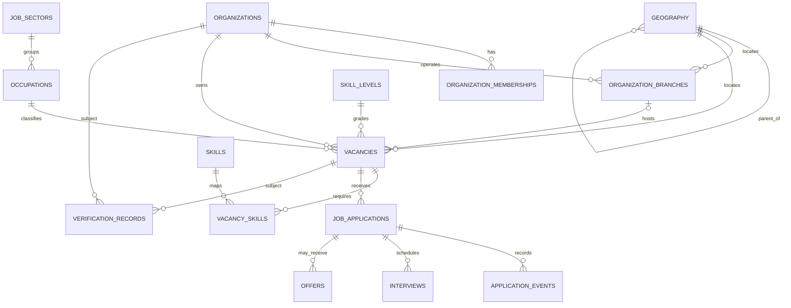

# Phase 2A — Jobs & Recruitment: Documentation-Only Specification

**Status:** Proposed for owner review; not implementation authorization.  
**Authority:** Supplied Immigration & Employment Global Mobility Master Plan V2, especially §§4–5, 31, 34–36.  
**Scope:** Documentation and diagrams only. No app code, migrations, schema changes, seeds, runtime/configuration/workflow changes, deployment, backup, restore, or migration execution.

## 1. Safety and current baseline

PR #24 is a separate branding/static-site increment. It must remain open and unmerged. This document does not mark V2 Phase 1 complete.

The current repository foundation is static HTML/CSS/JavaScript with sample job cards. No live recruitment API, database-backed vacancy search, candidate application workflow, employer/agency portal, moderation workflow, or private applicant-document flow has been verified. A successful static preview or green CI is not proof of those capabilities.

Phase 4C production backup, restore and migration execution remain **BLOCKED** until the owner separately approves an independent PostgreSQL recovery target and procedure, and independently verified evidence proves backup creation, read-back/integrity, and restore into that approved target. Synthetic tooling tests are not production recovery evidence.

## 2. Master Plan V2 requirements traceability

| Exact V2 reference | Requirement interpreted for Phase 2A | Current evidence | Test/evidence status | Remaining gap / acceptance evidence |
|---|---|---|---|---|
| §4 | Controlled sectors, occupations, skill levels and skills; vacancy location, qualifications/licences/languages, salary/currency/pay period, contract/hours, benefits/accommodation, count, sponsorship, verification, publication/expiry | Static sample cards only; no live domain model/API verified | NOT IMPLEMENTED | Approve field policy and catalogs; later validation, catalog provenance and API integration tests |
| §5 | Employer/recruiter marketplace; branches/worksites; employer verification; vacancy moderation; candidate pipeline; interviews, offers/contracts; agency licensing/jurisdiction, mandates, submissions, placements, fee disclosure, complaints/compliance | No operational marketplace or recruitment workflow verified | NOT IMPLEMENTED | Approve agency model, verification standards and initial jurisdiction; prove tenant isolation and role enforcement |
| §5 | Offer verification: unique reference, employer/worksite, contract link, QR/reference, expiry/withdrawal and audit | No offer-verification capability verified | NOT IMPLEMENTED | Decide whether in Phase 2A or later; specify revocation and public disclosure |
| §31 | React + TypeScript reference stack; PostgreSQL/Supabase where appropriate; storage; standards-based auth/MFA; CDN/WAF/API gateway; CI/CD; observability | Static foundation and governance workflows exist; no operational recruitment backend certified | PARTIAL at foundation/governance level | Approve target frontend, trusted API boundary, data/auth platform and Cloudflare topology |
| §34 | Availability, scalability, accessibility, localization, mobile responsiveness, fast search, resumable uploads, idempotency, observability, tested RPO/RTO and portability | Static presentation only; no recruitment SLO, upload, idempotency or restore evidence | NOT VERIFIED / NOT MET for product | Set measurable SLOs, locale/accessibility target, document controls and RPO/RTO |
| §35 — Phase 0 | Country/program selection, legal/privacy/security review, classification, threat model and authoritative policy sources | Governance documentation exists; Phase 2 launch jurisdiction is unresolved | PARTIAL; recruitment approvals unresolved | Owner selects launch jurisdiction/program and approves legal/privacy/security assessment |
| §35 — Phase 1 | Auth/MFA, organizations/roles, geography, person profile, audit, storage, admin catalogs, CI/CD | PR #24 is branding/static shell; operational auth/MFA, organization, profile, domain audit and private storage are not verified | NOT COMPLETE; CI/CD alone is insufficient | Track each foundation capability and evidence separately; do not claim V2 Phase 1 complete |
| §35 — Phase 2 | Employers/agencies, occupations/skills, vacancies, search, applications, interviews, offers/contracts, verification | No live recruitment-domain capabilities verified in current static site | NOT IMPLEMENTED | This specification is a proposal only; implementation needs separate authorization |
| §36 | Unit/integration, authorization/RLS, cross-tenant/country isolation, policy regression, payment/document security, penetration, accessibility, load/failover, restore, audit, privacy/retention, AI grounding/privacy/human-control gates | Existing CI and synthetic Phase 4C validation do not prove recruitment-specific gates | NOT PASSED for production recruitment release | Evidence each applicable release gate; no production release merely because features render |

**Evidence rule:** Every requirement must be marked PASS, PARTIAL, FAIL, NOT IMPLEMENTED or NOT VERIFIED with a linked artifact/test/review. A green build proves only the checks it actually ran.

## 3. Proposed logical data dictionary

Logical design only. No physical schema or database objects are created. IDs are opaque; timestamps are UTC; controlled values should use catalog references/enums, not arbitrary free text. Physical types, retention periods and exact constraints require a later reviewed migration proposal.

| Entity | Core fields | Purpose / rules |
|---|---|---|
| organizations | id, legal_name, display_name, type (employer/agency), registration_country, registration_number, status, verification_status, created_at, updated_at | Tenant boundary; legal/display names separated; status changes audited |
| organization_memberships | id, organization_id, user_id, role, status, invited_by, created_at, revoked_at | User-to-organization membership; role is tenant-scoped; revocation effective immediately |
| organization_branches | id, organization_id, name, country_code, geography_id, address_text, status | Branch/worksite belonging to one organization |
| agency_compliance (proposed extension) | organization_id, licence_number, jurisdiction, valid_from, valid_until, verification_status, mandate_evidence_ref | Agency licensing; agency acts for employer only with valid mandate |
| geography | id, country_code, parent_id, level, canonical_name, alternate_names, source_ref, valid_from, valid_until | Country → region/province → city → town/locality; versioned approved source |
| job_sectors | id, code, label, source_ref, active | Controlled sector catalog |
| occupations | id, code, label, sector_id, framework, framework_version, active | Versioned occupation taxonomy; codes must not be invented |
| skill_levels | id, code, label, framework, framework_version, active | Controlled skill-level catalog |
| skills | id, code, label, aliases, framework, framework_version, active | Canonical searchable skills with aliases |
| vacancies | id, organization_id, branch_id, created_by, reference_code, slug, title, description, sector_id, occupation_id, skill_level_id, geography_id, worksite_text, employment_type, contract_duration, hours_per_week, salary_min, salary_max, salary_currency, pay_period, benefits, accommodation_provided, qualification_requirements, licence_requirements, language_requirements, vacancies_count, sponsorship_status, application_deadline, published_at, expires_at, status, moderation_state, verification_state, version, created_at, updated_at | Canonical vacancy; salary min ≤ max; ISO currency; explicit deadline/expiry; publication requires approved checks |
| vacancy_skills | vacancy_id, skill_id, proficiency_level, required | Many-to-many; unique vacancy/skill pair |
| job_applications | id, vacancy_id, candidate_user_id, status, submitted_at, withdrawn_at, candidate_snapshot_ref, idempotency_key_ref, created_at, updated_at | Candidate-owned application; identity from session, not request body |
| application_events | id, application_id, actor_user_id, event_type, from_status, to_status, reason_code, created_at | Append-only status history |
| interviews | id, application_id, scheduled_start, scheduled_end, timezone, mode, private_location_or_join_ref, status, created_by | Restricted to candidate and authorized hiring team |
| offers (later scope unless approved) | id, application_id, offer_reference, status, issued_at, expires_at, withdrawn_at, contract_document_ref, verification_code_hash | Unpredictable, revocable references; document private |
| verification_records | id, subject_type, subject_id, jurisdiction, verification_type, status, source_ref, checked_at, expires_at, reviewed_by, evidence_ref | Source and date of checks; not a guarantee of immigration eligibility |
| audit_events | id, actor_user_id, organization_id, action, resource_type, resource_id, outcome, request_id, occurred_at, minimized_metadata | Append-only security trail; exclude credentials, CV contents and unnecessary personal data |

### Data handling rules

- Never expose CVs, passports, identity documents, private evidence, internal moderation notes or candidate identities in public vacancy APIs, URLs, logs or analytics.
- Candidate documents require private object storage, ownership checks, short-lived authorized access, malware scanning, file size/type controls, retention/deletion and access logging. This is a dependency, not implemented here.
- Country-specific eligibility, sponsorship and licensing rules must cite official sources, be versioned/date-stamped, and be reviewed. Do not infer legal eligibility from occupation or nationality.
- Render vacancy descriptions safely against stored XSS. Never log raw idempotency keys, access tokens or verification secrets.
- Soft deletion is not a retention policy. Legal hold, retention, deletion, export, data residency and subject-rights rules need legal/owner approval.

## 4. Entity relationships

Conceptual Mermaid ER diagram; it is not a database migration.



Open modelling choices: agency as organization subtype vs separate entity; representation of organization verification; whether one application can receive multiple offers; and how candidate/profile identity links are modelled.

## 5. Vacancy lifecycle and permitted transitions

States:
- **draft** — editable by authorized organization members; not publicly searchable.
- **pending_review** — submitted for moderation.
- **changes_requested** — reviewer requests corrections with reason.
- **rejected** — reviewer rejects with reason; revised submission requires a new review cycle.
- **published** — public only while valid and after required checks.
- **suspended** — immediately hidden for safety, verification or compliance concerns.
- **closed** — no longer accepts applications; existing applications remain governed by retention policy.
- **expired** — deadline/window ended; hidden and closed to applications.
- **archived** — read-only terminal state; reactivation is prohibited, create a new version instead.

| From → to | Authorized actor / guard |
|---|---|
| draft → pending_review | Authorized organization member; validation passes; organization active |
| pending_review → published | Moderator/approved policy engine only; verification and all required checks pass |
| pending_review → changes_requested or rejected | Moderator only; reason code and audit event required |
| changes_requested → pending_review | Authorized organization member after correction and validation |
| rejected → draft | Organization member creates revised version; prior decision retained |
| published → suspended | Moderator/admin or safety control; reason recorded; public hiding immediate |
| suspended → pending_review | Authorized reviewer after remediation; full revalidation; employer cannot self-clear |
| published → closed | Authorized organization member or moderator |
| published → expired | Idempotent system process at expiry; event recorded |
| closed/expired → archived | Authorized retention process/admin under approved policy |

Forbidden: employer/agency self-publishing, self-approval of verification, clearing suspension, or overriding moderation; public users changing state; reactivating archived vacancies in place. Any admin override needs explicit approval, least privilege, reason, audit and independent review.

Application pipeline is separate: proposed submitted → under_review → shortlisted → interview_scheduled → offer_issued → hired, with side states rejected, withdrawn and closed. Each transition requires permission, valid source state, append-only event and idempotency. Duplicate-application and reapplication rules need owner approval.

## 6. Proposed API contracts (not implemented)

### Conventions
- Base path /api/v1; JSON UTF-8; RFC 3339 UTC timestamps; opaque IDs; cursor pagination.
- Authentication and tenant are derived from verified session/membership. Never trust user ID, organization ID, role, verification state or requested transition supplied by client.
- Use version/ETag preconditions for edits and Idempotency-Key for application submission; cap page size, query length and payload size.
- Public reads expose only published, in-window vacancies. Rate-limit search and submission. Do not reveal hidden-resource existence.
- Runtime, gateway and auth implementation remain architecture decisions.

### Public search
GET /api/v1/jobs?country=KE&region=...&city=...&sector=...&occupation=...&skill=...&q=...&employment_type=...&sponsorship=...&cursor=...&limit=25

Illustrative 200 response (not real vacancy data):
```json
{
  "data": [{
    "id": "vac_opaque",
    "reference": "JG-EXAMPLE",
    "slug": "sample-role-location",
    "title": "Sample role",
    "organization": {"displayName": "Example employer", "verificationStatus": "verified"},
    "location": {"countryCode": "KE", "region": null, "city": null, "town": null},
    "occupation": {"code": "SOURCE-CODE", "label": "Example occupation"},
    "employmentType": "full_time",
    "salary": {"min": null, "max": null, "currency": null, "payPeriod": null},
    "sponsorshipStatus": "not_stated",
    "publishedAt": "2026-01-01T00:00:00Z",
    "expiresAt": "2026-02-01T00:00:00Z"
  }],
  "page": {"nextCursor": null, "limit": 25},
  "requestId": "req_opaque"
}
```
No values or codes in examples assert an actual vacancy or legal policy. Unknown salary is null, never fabricated.

### Public detail
GET /api/v1/jobs/{slug}
- 200: public vacancy, safe organization summary, requirements and application instructions.
- 404: nonexistent or non-public vacancy; do not disclose hidden status.
- Never return candidate information, internal review notes, private evidence or private document URLs.

### Organization/moderation commands
- POST /api/v1/organizations/{organizationId}/vacancies — create draft.
- PATCH /api/v1/organizations/{organizationId}/vacancies/{vacancyId} — edit authorized draft/changes-requested version with If-Match/version.
- POST /api/v1/organizations/{organizationId}/vacancies/{vacancyId}/submit — validate and request review.
- POST /api/v1/moderation/vacancies/{vacancyId}/decision — publish, request_changes or reject with reason code and reviewer note.
- POST /api/v1/moderation/vacancies/{vacancyId}/suspend — hide immediately with reason.
- POST /api/v1/organizations/{organizationId}/vacancies/{vacancyId}/close — close authorized published vacancy.

Example create-draft request:
```json
{
  "title": "Example role",
  "description": "Draft description",
  "sectorId": "sector_opaque",
  "occupationId": "occupation_opaque",
  "skillLevelId": "level_opaque",
  "geographyId": "geo_opaque",
  "employmentType": "full_time",
  "salary": {"min": 1000, "max": 1500, "currency": "USD", "payPeriod": "month"},
  "vacanciesCount": 1,
  "sponsorshipStatus": "not_stated",
  "expiresAt": "2026-12-31T23:59:59Z"
}
```
Server assigns ID, reference, tenant, creator, status, timestamps and moderation state. Reject invalid catalog IDs, currency, date, salary range, lengths and forbidden client-managed fields.

### Application submission
POST /api/v1/jobs/{vacancyId}/applications  
Header: Idempotency-Key: opaque client-generated key

```json
{
  "coverLetter": "Optional bounded text",
  "resumeDocumentId": "private_document_opaque"
}
```

Illustrative 201:
```json
{
  "data": {
    "id": "app_opaque",
    "vacancyId": "vac_opaque",
    "status": "submitted",
    "submittedAt": "2026-10-09T00:00:00Z"
  },
  "requestId": "req_opaque"
}
```
Candidate identity comes from session. Verify vacancy is accepting applications and document ownership/scan status. Same key returns the original result. Duplicate-application policy and key retention need approval.

### Error envelope
```json
{
  "error": {
    "code": "VALIDATION_FAILED",
    "message": "One or more fields are invalid.",
    "fields": [{"field": "salary.min", "code": "MUST_NOT_EXCEED_MAX"}]
  },
  "requestId": "req_opaque"
}
```
Stable codes/statuses: UNAUTHENTICATED (401), FORBIDDEN (403 or non-disclosing 404), NOT_FOUND (404), VALIDATION_FAILED (400/422), CONFLICT (409), RATE_LIMITED (429), INTERNAL_ERROR (500). Never return stack traces, SQL, secrets, private evidence or raw provider errors.

## 7. Authorization matrix

Roles are additive only when explicitly assigned. Organization roles require active membership. Agency action for an employer additionally requires valid licence and mandate. Moderation is separate from employer/agency membership. Administrator access is least-privilege and audited.

| Action | Candidate | Employer member | Agency member | Moderator | Administrator |
|---|---|---|---|---|---|
| Read published public vacancy | Yes | Yes | Yes | Yes | Yes |
| Read/edit own profile and applications | Own only | No unless separately candidate | No unless separately candidate | No by default | Restricted audited support access |
| Create/edit organization draft | No | Authorized own organization | Own agency only | No | Exceptional audited action |
| Submit vacancy for review | No | Authorized member | Own agency or valid delegated mandate | No | Exceptional audited action |
| Publish/reject/request changes | No | No | No | Yes, policy/jurisdiction scoped | Exceptional override only if approved and audited |
| Suspend vacancy | Report only | Request review | Request review | Yes | Yes, audited |
| Read applications | Own only | Own organization's vacancies and authorized hiring role | Only delegated cases under mandate | Case-specific only | Restricted audited access |
| Update hiring pipeline / interviews / offers | Withdraw own application only | Authorized hiring role in own org | Valid delegated authority only | No by default | Exceptional audited intervention |
| Manage org memberships | No | Designated org owner/admin | Agency owner/admin for own agency | No | Restricted audited intervention |
| Verify employer/agency/licence | No | Cannot self-verify | Cannot self-verify | Approved verifier | Controlled and audited |
| Change global catalogs/policy | No | No | No | Propose corrections | Designated catalog/policy admin |
| Read audit/security events | Own receipts only | Limited own-tenant events if approved | Limited delegated events | Moderation scope | Security/audit role only |
| Grant global roles/change access controls | No | No | No | No | Authorized identity/security admin with independent audit |

Enforce server-side and, if Supabase is chosen, with RLS as defense in depth. Client-side hiding is never authorization. Prove tenant isolation for APIs, search, storage, exports, background jobs and audit views. Decide whether platform roles and tenant roles are separate.

## 8. Security and acceptance test plan

Tests below are requirements for a later authorized implementation, not tests executed by this PR.

| Area | Acceptance test | Required evidence |
|---|---|---|
| Auth/MFA | Anonymous protected calls fail; expiry/revocation enforced; privileged-role MFA policy works | Automated auth tests and configuration review |
| Object and tenant access | User A cannot read/edit User B data; Org A cannot access Org B vacancies, applications, members or documents | Positive/negative integration and RLS tests; cross-tenant fuzzing |
| Privilege escalation | Candidate cannot grant admin; employer cannot self-verify/self-publish; agency cannot act without valid licence/mandate | Regression tests via API and direct data paths |
| Lifecycle | Invalid transitions rejected; accepted transitions record actor/from/to/reason/time; suspended/expired/closed jobs immediately disappear from public search | State-machine and integration tests |
| Validation | Invalid catalogs, currency, salary, timestamps, enum, oversized payload and malicious Unicode rejected | Schema/property-based tests |
| Injection/XSS | Stored/reflected XSS inert; SQL/filter injection cannot broaden tenant scope | UI/API security tests and code review |
| Documents | Private by default; owner verified; size/type allowlist; malware scan; short-lived links; retention/deletion tested | Storage policy and malicious-file tests |
| Idempotency/concurrency | Repeated submission creates one application; stale edit conflicts; retries safe | Replay/race integration tests |
| Rate limiting | Search/sign-in/apply/moderation resist enumeration, scraping and floods | Abuse/load tests and monitoring evidence |
| Audit/PII | Ordinary users cannot alter audit; logs exclude CV/passport contents and tokens | Log inspection, audit completeness and retention review |
| Privacy | Approved purpose, access/export/correction/deletion and retention for each jurisdiction | Privacy/legal review and policy regression |
| Search/SEO | Only public published vacancies indexed; no candidate/private URL indexed; filters/pagination correct | Crawl/meta and API integration tests |
| Accessibility/localization | Keyboard/screen-reader, contrast/labels/errors, mobile layout and localized currency/date/time | Automated scans plus manual QA |
| Reliability | Search/load, retry, observability, failover and SLOs validated | Load tests, dashboards/alerts and failure exercise |
| Recovery/release | Restore to separately approved target; RPO/RTO evidenced; penetration and V2 release-gate review | Owner-approved runbook and independent evidence; Phase 4C stays blocked |

No production release solely because pages render or CI is green. Payments, AI matching, automated eligibility decisions and digital signatures remain out of scope until product/legal/security/human-oversight requirements are approved.

## 9. Architecture comparison and Cloudflare constraints

| Option | Strengths | Limitations / risk | Decision |
|---|---|---|---|
| Current static HTML/CSS/JS/Web Components | Fast, low dependency footprint, preserves branded shell and useful preview | No trusted server boundary, database authorization, private applicant data, secure application workflow, moderation or live search by itself | Retain as shell/prototype or replace incrementally; sample jobs must remain labelled |
| React + TypeScript | Typed components, ecosystem, complex forms and testing support; matches V2 §31 reference stack | Adds build/framework complexity; frontend types do not secure backend | Owner decides target frontend and migration path |
| Supabase/PostgreSQL | Relational constraints, transactions, RLS, auth/storage integration and query support | RLS and service-role boundaries are critical; schema changes need migration governance; browser must never hold privileged keys; prior Cloudflare runtime binding risks need verification | Approve as primary data/auth platform or choose alternative |
| Cloudflare Pages static hosting | CDN/static assets and preview | Successful static Pages deployment does not prove Workers API or Supabase connectivity | Identify actual production topology and project ownership |
| Cloudflare Workers/OpenNext | Potential server-side Next.js route hosting when build/runtime supported and correctly configured | Current verified static foundation does not establish a functioning deployed Worker API; build/runtime environment mismatch and binding errors are risks | Decide whether Next.js/OpenNext Workers or static frontend plus separate API; verify non-production end-to-end first |
| Trusted API/service layer | Central validation, policy, idempotency, rate limiting and audit | Cannot trust client checks; avoid duplicate policy sources | Decide where trusted business logic runs |
| Private object storage | Isolates CVs/contracts/evidence from public assets | Requires scan, signed access, retention, lifecycle and incident response | Approve provider and document policy |

**Architecture principle proposed:** typed frontend, trusted server/API boundary, PostgreSQL constraints/RLS, private object storage, structured audit and observability. This aligns with §31 but does not authorize a rewrite. Keep public assets separate from candidate documents; never expose service-role secrets in browser bundles. Verify Cloudflare build command, supported routes, bindings and preview-only end-to-end behavior before considering production.

## 10. Owner decisions required

1. Initial launch country/program, source/destination countries and official policy sources.
2. Phase 2A boundary: recommended first slice is catalogs + employer vacancy drafts/moderation + public search; applications/interviews/offers later unless explicitly included.
3. Agency as organization subtype or separate entity; licensing, mandate, fee disclosure, complaints and candidate-submission rules.
4. Employer/agency verification evidence, reviewer, re-verification interval and expiry behavior.
5. Frontend target: keep static shell, incrementally adopt React + TypeScript, or rebuild UI.
6. Backend/deployment: Supabase API through Cloudflare Workers/OpenNext or separate API; source of truth for runtime and secret/binding ownership.
7. Identity provider, MFA by role, platform vs tenant roles, account recovery and session revocation.
8. Candidate profile/document fields, formats, storage, malware scanning, access, retention/deletion and data residency.
9. Vacancy required fields, salary disclosure, sponsorship vocabulary, deadlines, moderation SLA, rejection reasons, suspension and appeal.
10. Duplicate applications, withdrawal, reapplication, consent and post-closure retention.
11. Languages/locales, geography authority, occupation/skills framework/version, currency and timezone rules, SEO indexability.
12. Offer verification/contracts phase, QR/reference, revocation, digital signature and legal enforceability.
13. Whether payments, memberships, AI matching/ranking or eligibility assistance enter scope; human review, explanation and bias testing.
14. Data classification, lawful purpose, privacy/retention, subject rights, incident response and audit access.
15. SLOs, monitoring ownership, RPO/RTO and independent recovery target. Phase 4C stays blocked pending separate approval/evidence.
16. Acceptance owner, security/legal/privacy reviewers, accessibility bar and explicit release checklist.

## 11. Documentation PR acceptance checklist

- [ ] Diff contains documentation and diagrams only; no application code, migrations, schema, seeds, configuration, workflow or deployment changes.
- [ ] Exact V2 section references and evidence gaps are explicit.
- [ ] No claim that V2 Phase 1 is complete.
- [ ] Product/security/engineering review data dictionary, transitions, API contracts and authorization.
- [ ] PR #24 and this PR remain open/unmerged until explicit owner approval.
- [ ] Phase 4C backup, restore and migration execution remain blocked.

## 12. Evidence links

- PR #24: https://github.com/job-grid/job-grid/pull/24
- Repository baseline: https://github.com/job-grid/job-grid/tree/main
- CI workflow: https://github.com/job-grid/job-grid/blob/main/.github/workflows/ci.yml
- Production deployment gate: https://github.com/job-grid/job-grid/blob/main/.github/workflows/production-deploy.yml
- Phase 4C boundaries: https://github.com/job-grid/job-grid/blob/main/docs/phase-4c-recovery-boundaries.md
- Phase 4C implementation notes: https://github.com/job-grid/job-grid/blob/main/docs/phase-4c-implementation.md
- Migration governance: https://github.com/job-grid/job-grid/blob/main/docs/database-migrations.md

**Requested disposition:** review the contract and record decisions. This proposal does not authorize implementation, migration, recovery activity or production release.
